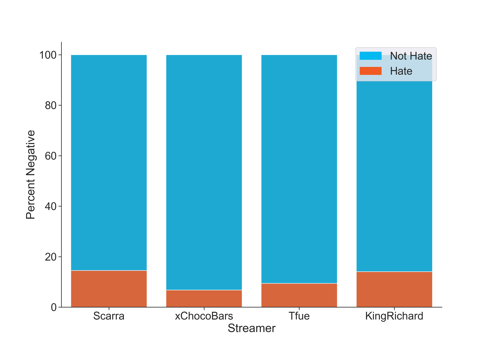

# Twitch Hate Chat Identification
Author: [Kelsey Lane](kelsklane@gmail.com)
## Overview
This project uses chatlogs scraped for a [Harvard study](https://dataverse.harvard.edu/dataset.xhtml?persistentId=doi:10.7910/DVN/VE0IVQ) from different Twitch streams to try and identify hate chats in order to help Twitch's safety operations team better detect these comments and use this information to improve their chat filters. These streams occured during April - June of 2018 and the subset used for this project consists of four different streamers with nine total streams. Sentiment analysis is used to identify negative comments and the relative importance of these words for predicting hate chats can be pulled from the model to help build a more robust filter. The packages used for this project can be seen in the environment file provided in the repository.
## Technical Overview
The data I'm using for this project are chat messages scraped from Twitch livestreams with metadata about the time the message was sent, how far into the stream th message was sent and more. This is suited for the business problem as the aim is to help Twitch more efficently screen and filter out hate messages, so modeling the sentiment of the messages is a step towards helping with this. To prep the data I used VADER from NLTK to assign a negative or not negative label to each chat. As for cleaning the data I filtered out as many messages sent by bots as I could and got rid of any messages with links using regular expressions, as these are often just advertisments and not meaningful chats. As for the tokenization process, I used NLTK's Tweet tokenizer as this suits Twitch chats since they pattern similarly to tweets in terms of shortness and the casual usage of language. I left capitalization and stop words in, as past work with short, casual messages has shown these can improve model performance. Finally, unnecessary punctuation is filtered out and the remaining words are lemmatized to help reduce the number of features. The main two models used for the sentiment anaylsis were the Multinomial Bayes and Logistic Regression models from sklearn, as these often work well with sentiment analysis and were simple enough to run effectively with the amount of data I had. Sklearn's count vectorizer was used alongside a custom tokenization function to break the chats up and these vectorizers were tuned using a GridSearch to mess with the maximum number of features in the dataset, the frequency cutoff for the higher frequency words, whether bigrams should be used or not, and if the words should all be lowercase or not. The logistic regression models were also tuned, but the only change from the default was to increase the number of iterations as not all models converged with the default number. While iterating throughout the models, a train test split was performed and the training data was furthur cross validated using sklearn's cross_validate library. The final model is a logistic regression that has an accuracy of 95% with a recall of 76%. 
## Business Understanding
Twitch has an issue with cyberbullying in their chats. According to a [survey done in 2018](https://blog.streamelements.com/streamelements-analysis-on-twitch-bullying-c3f2b2240318), over a quarter of people have seen some type of bullying in chats during a livestream and over 13% of streamers have felt bullied at some point. On top of that, only 26.4% of people thought Twitch was effective in combating the bullying present on their platform. This bullying can have serious consequences for the mental health of not only the streamers, but also the viewers participating in the chat. Therefore, in an effort to help Twitch's safety operations team better tackle this issue, I propose using a sentiment analysis model to help better identify hate chats. By doing this, it can help flag these chats faster for moderators to view and deal with, while also helping highlight common words between these hate chats so they can be added to the filter system in place. As a result, this would build a stronger and more effective filter that will help moderate chats going forward. This can help combat the bullying issue present on Twitch's platform while also creating a more welcoming environment, especailly for BIPOC and LGBTQ+ people that are often the target of this bullying.
## Data Understanding
The dataset for this project comes from a [Harvard study](https://dataverse.harvard.edu/dataset.xhtml?persistentId=doi:10.7910/DVN/VE0IVQ) and contains chatlogs from 50 different streamers with around 25 streams per streamer. As the total original data contains too many rows to efficiently run on my computer, I paired the dataset down to 4 streamers with 9 streamers total, so around 2 streamers for each streamer with one, KingRichard, having 3 streams to keep the number of chats at about 25,000 for each person. In the end, this reuslted in a dataset with 102,700 rows where each row is a unique chat. When creating the dataset read in below, only chats with the user commenter type were kept, as chats from admins and moderators are not going to contain hate messages. The `fragments` column from the original dataset was broken out into a `twitch_chat` column and `emotes` column to better manipulate the data. The original dataset also contained chats that were edited, though it was never made clear if this was by users or moderators manually filtering hate speech out. Due to this uncertainty, any edited rows were dropped. Finally, any chats that start with an exclamation point were filtered out, as on Twitch these are commands used to call bots and are thus not actual comments about the stream. The final datasetby merging the nine streams together and dropping the `fragments` and `updated_at` columns, as these were manipulated previously and thus supply no more useful information. This smaller dataset is imported in the cell below and the code for generating can be found in the [Merge_datasets](https://github.com/kelsklane/Twitch_Capstone/blob/main/notebook/Merge_datasets.ipynb) notebook in the notebook folder. While doing data exploration, I found some bot messages sending links to the streamers Patreon or Discord server, as well as advertisements for other Twitch streams. In an effort to narrow the data down to only human messages, any chat message with a link is dropped from the dataset. Finally, in preperation for generating the labels for the data, certain emotes are truncated down to one form. VADER is used to create the target labels for the data. As Twitch has a lot of platform specific lingo in terms of slang and emotes, some of the more popular words are added to VADER's lexicon in order to generate more accurate labels for the data. The full added vocabulary is included below, where the sentiment values are calculated from [this study](https://dl.acm.org/doi/10.1145/3365523). Finally, the labels are generated using VADER, where negative chats are labeled as 1 and non-negative as 0. The distribution of hate chats for each streamer can be seen below.

## Data Preparation
In an effort to help better identify hate chats, a few additional features were added to the data. The first is the time of day of the stream, as streams at night may recieve more or less hate than those during the day. Due to the overwhelming amount of streams occuring at night, the streams are categorized as being during the day if they fall between 7am to 8pm, then night is broken into night at 8pm to midnight and late night from midnight to 7am. Other features added were if the original chat included an emote, as some emotes require the user to subscribe to the Twitch streamer, and thus these users are less likely to comment hate messages. Furthermore, the ratio of capital letters in the chat is included as its own feature to help capture the energy of the sentiment in its own column, as some models make all the chats lowercase and this information can get lost. Another feature added was `offset_percent`. In the original dataset, offset represents how many seconds from the start of the stream the chat was made. In an effort to normalize these offset values across all the different streams, the max time for each stream was pulled out from the data and the offset value divided by this in order to get the percent into the steram the chat was made. The last feature added is the total comments made by each user during a stream. While it's not clear if these anonymized ids are kept between streams, they are treated as unique to each stream occurrance and the total number of comments for that user are calculated as such. This can be a useful feature as sometimes people may spam hate comments, so the quantity of chats made by a user may help distinguish hate chats from regular ones. Any other columns aside from the `label`, `chat`, and `video_id` columns are dropped.
## Modeling
The first simple model in this case is a Naive Bayes model that takes in only the chat messages. This just gives us a raw estimation of how well we could expect a model to do based on chats alone. While recall is the metric used, I've found that for validations it can be a lot higher than the training set, so to get a better gauge of if the model is overfitting or underfitting, I also look at accurracy as a comparison metric. This model has a training recall of 55% and accuracy of 91%. Variations of Bayes models and logistic regression ones are tuned and iterated over until reaching the final model. This final model is a logistic regression using a count vectorizer that has an accuracy of 95% on the test set and a recall of 76%. The confusion matrix for it is displayed below.

## Evaluation
The main metric used to evaluate this is recall, as while detecting hate chats, they would be flagged for manual review. Therefore, emphasizing properly catching anything regarded as negative and accidentally mislabeling some neutral or positive chats as a result seems like a fair trade off. As mentioned above, this final model has a recall of 76%. The final model overall does fairly well. Due to the fact that the final recall is around 76% and the labels aren't entirely accurate, I would hesitate to implement this without some kind of human check. As a result, the final model could help flag potential hate comments that can be used to help inform moderators faster of potentially problematic chats. Furthermore, the log odds of certain words predicting a negative chat can be drawn out from the model. These can be used to help inform what words might be good to add to the chat filter to help improve it.
## Conclusion
Overall, this model would be good to implement as a tool to help current streamers and moderators in keeping hate out of their chat and identifying it with more ease. This model can also help strengthen existing filters to make the system more effective. On it's own though, the model is still lacking in fully tackling the hate speech problem present on Twitch. Going forward, it would therefore be useful to get more accurate labels for the data to help train a more useable model. It could also be useful to model other languages as well as train models to target more specific categories of streams, as the type of language used for certain types of streams can vary a lot.
## More Information
To see the full code you can view the notebook [here](https://github.com/kelsklane/Twitch_Capstone/blob/main/Twitch_Negative_Chat.ipynb) or see the slidedeck [here](https://github.com/kelsklane/Twitch_Capstone/blob/main/presentation.pdf).
## References
#### Data:
Kim, J. (2019, August 1). Twitch.tv chat log data. Harvard Dataverse. Retrieved November 30, 2021, from https://dataverse.harvard.edu/dataset.xhtml?persistentId=doi%3A10.7910%2FDVN%2FVE0IVQ. 

#### Sources:
Würzburg, K. K. J.-M.-U., Kobs, K., Würzburg, J.-M.-U., Würzburg, A. Z. J.-M.-U., Zehe, A., Würzburg, A. B. J.-M.-U., Bernstetter, A., Würzburg, J. C. J.-M.-U., Chibane, J., Würzburg, J. P. J.-M.-U., Pfister, J., Würzburg, J. T. J.-M.-U., Tritscher, J., Würzburg, A. H. J.-M.-U., Hotho, A., University, S., &amp; Metrics, O. M. V. A. (2020, May 1). Emote-controlled: Obtaining implicit viewer feedback through emote-based sentiment analysis on comments of popular Twitch.tv channels. ACM Transactions on Social Computing. Retrieved November 30, 2021, from https://dl.acm.org/doi/10.1145/3365523. 
Yosilewitz, A. (2018, August 6). Streamelements analysis on Twitch bullying. Medium. Retrieved November 30, 2021, from https://blog.streamelements.com/streamelements-analysis-on-twitch-bullying-c3f2b2240318. 
## Repository Structure
`
├── Images
│   ├── confusion_matrix.jpg
│   ├── single_stream.png
│   ├── streamer_percent.png
│   ├── streamers.png
│   ├── time_of_day.png
│   ├── twitchlogo.jpg
│   └── wordcloud.png
├── README.md
├── Twitch_Negative_Chat.ipynb
├── data
│   └── small_merged_chats
├── environment.yml
├── notebook
│   ├── FSM - First Simple Model.ipynb
│   ├── Merge_datasets.ipynb
│   └── Models.ipynb
└── presentation.pdf
`
