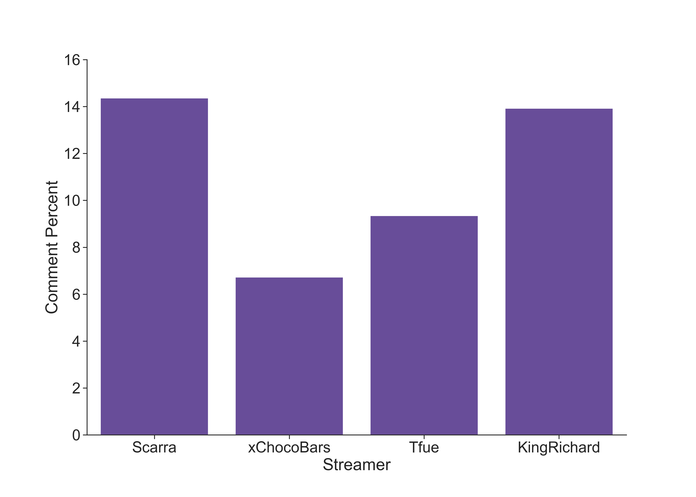
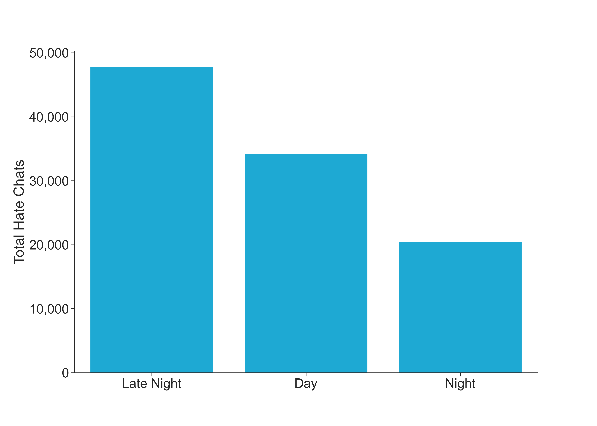
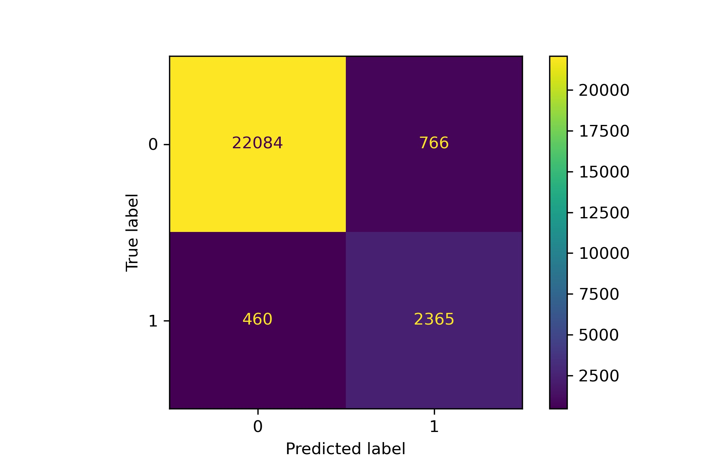

# Twitch Hate Chat Identification
Author: [Kelsey Lane](kelsklane@gmail.com)
## Overview
This project aims to build a classificaiton model to better identify hate chats on Twitch livestreams. The dataset used has four streamers and nine total streams from [this Harvard database](https://dataverse.harvard.edu/dataset.xhtml?persistentId=doi:10.7910/DVN/VE0IVQ) is used in this project. These streams occurred during April - June of 2018. Sentiment analysis is used to identify negative comments which can be used to flag hate chats as they are sent. The relative importance of different words that predict hate chats can also be pulled from the model to help build a better filter. The packages used for this project can be seen in the [environment file](https://github.com/kelsklane/Capstone_Twitch_NLP/blob/main/environment.yml) provided in the repository.
## Technical Overview
The data I'm using for this project are chat messages scraped from Twitch livestreams with metadata about the time the message was sent, how far into the stream the message was sent and more. This is suited for the business problem as the aim is to help Twitch more efficiently screen and filter out hate messages, so modeling the sentiment of the messages is a step towards this. To prep the data I used VADER from NLTK to assign a negative or not negative label to each chat. Cleaning the data involved filtering out as many messages sent by bots as I could and got rid of any messages with links using regular expressions, as these are often just advertisements and not real chats. For the tokenization process, I used NLTK's Tweet tokenizer as chats are similar in structure to tweets. I left capitalization and stop words in, as casual messages often have better performance with these included. Finally, unnecessary punctuation is filtered out and the remaining words are lemmatized to help reduce the number of features. 

The main two models used for the sentiment analysis were the Multinomial Bayes and Logistic Regression models from sklearn, as these often work well with sentiment analysis and were simple enough to run effectively with the amount of data I had. Sklearn's CountVectorizer was used alongside a custom tokenization function to break the chats up and these vectorizers were tuned using a GridSearch to alter the maximum number of features in the dataset, the frequency cutoff for the higher frequency words, whether bigrams should be used or not, and if the words should all be lowercase or not. The logistic regression model was also tuned, but the only change from the default parameters was to increase the number of iterations. While iterating throughout the models, a train test split was performed and the training data was further cross validated using sklearn's `cross_validate` library. The final model is a logistic regression that has an accuracy of 95% with a recall of 76%. 
## Business Understanding
Twitch has an issue with cyberbullying in their chats. According to a [survey done in 2018](https://blog.streamelements.com/streamelements-analysis-on-twitch-bullying-c3f2b2240318), over a quarter of people using Twitch have seen some type of bullying in chat messages. In addition, over 13% of streamers have felt bullied at some point. While Twitch has measures in place for combating bullying, only 26.4% of people thought they were effective. This bullying can have serious consequences for the mental health of not only the streamers, but also the viewers participating in the chat. Therefore, in an effort to help Twitch's safety operations team better tackle this issue and create a safer platform, I propose using a sentiment analysis model to help better identify hate chats. This model can help flag these chats faster for moderators to view and deal with. Words common to hate messages can also be identified and added to existing filters to strengthen them. This can help combat the bullying issue present on Twitch's platform while also creating a more welcoming environment, especially for BIPOC and LGBTQ+ people that are often the target of this bullying.
## Data
The dataset for this project comes from a [Harvard study](https://dataverse.harvard.edu/dataset.xhtml?persistentId=doi:10.7910/DVN/VE0IVQ) and was paired down to 102,700 rows, where each row is a unique chat. Only unedited chats made by viewers were kept. The code for generating this dataset can be found in the [Merge_datasets](https://github.com/kelsklane/Twitch_Capstone/blob/main/notebook/Merge_datasets.ipynb) notebook in the notebook folder. VADER is used to create the target labels for the data. Chats deemed negative by VADER are labeled as 1 and non-negative as 0. This becomes the target variable for the sentiment analysis. The distribution of hate chats for each streamer can be seen below.

A few additional features were added to the data. The first is the time of day of the stream. Due to the overwhelming amount of streams occurring at night, the streams are categorized as being during the day if they fall between 7am to 8pm, then night is broken into night at 8pm to midnight and late night from midnight to 7am. The distribution of hate chats for these times of day is pictured below.

Other features added were if the original chat included an emote, the ratio of capital letters in the chat, and `offset_percent`. In the original dataset, offset represents how many seconds from the start of the stream the chat was made. In an effort to normalize these offset values across all the different streams, the offset was divided by the length of the stream to get the percent for how far into the stream the chat was made. The last feature added is the total comments made by each user during a stream. From the original dataset, only `label`, `chat`, and `video_id` are kept.
## Modeling
The first simple model is a Naive Bayes model that takes in only the chat messages. This just gives a raw estimation of how well we could expect a model to do based on chats alone. While recall is the metric used, I also look at accuracy as a comparison metric. This model has a training recall of 55% and accuracy of 91%. Variations of Bayes models and logistic regression ones are tuned and iterated over until reaching the final model. This final model is a logistic regression using a count vectorizer that has an accuracy of 95% on the test set and a recall of 76%. The confusion matrix for it is displayed below.

## Evaluation
The main metric used to evaluate this is recall as I wanted to weight the model against false negatives. Since chats are ultimately being flagged for manual review, mislabeling some neutral and positive chats as negative is a fair tradeoff for capturing as many negative chats as possible. As mentioned above, this final model has a recall of 76%. The final model overall does fairly well. Due to the recall score and labels coming from VADER, I would recommend implementing the model as a tool for moderators to use to help them sort through chats more efficiently. Therefore, the final model could help flag potential hate comments that would inform moderators faster of potentially problematic chats. Furthermore, the log odds of certain words predicting a negative chat can be drawn out from the model. These can be used to help inform what words might be good to add to the chat filter to help improve it.
## Conclusion
Overall, this model has high potential as a tool to help current streamers and moderators identify hate faster. This model can also help strengthen existing filters to make the system more effective. On its own though, the model is still lacking in fully tackling the hate speech problem present on Twitch. Going forward, it would therefore be useful to get more accurate labels for the data to help train a more useable model. It could also be useful to model other languages as well as train models to target more specific categories of streams, as the type of language used for certain types of streams can vary a lot.
## More Information
To see the full code you can view the notebook [here](https://github.com/kelsklane/Twitch_Capstone/blob/main/Twitch_Negative_Chat.ipynb) or see the slidedeck [here](https://github.com/kelsklane/Twitch_Capstone/blob/main/presentation.pdf).
## References
#### Data:
Kim, J. (2019, August 1). Twitch.tv chat log data. Harvard Dataverse. Retrieved November 30, 2021, from https://dataverse.harvard.edu/dataset.xhtml?persistentId=doi%3A10.7910%2FDVN%2FVE0IVQ. 

#### Sources:
Yosilewitz, A. (2018, August 6). Streamelements analysis on Twitch bullying. Medium. Retrieved November 30, 2021, from https://blog.streamelements.com/streamelements-analysis-on-twitch-bullying-c3f2b2240318. 
## Repository Structure
```
├── Images
│   ├── confusion_matrix.jpg
│   ├── single_stream.png
│   ├── streamer_percent_only_negative.png
│   ├── streamer_percent.png
│   ├── streamers.png
│   ├── time_of_day.png
│   ├── twitchlogo.jpg
│   └── wordcloud.png
├── README.md
├── Twitch_Negative_Chat.ipynb
├── data
│   └── small_merged_chats
├── environment.yml
├── notebook
│   ├── FSM - First Simple Model.ipynb
│   ├── Merge_datasets.ipynb
│   └── Models.ipynb
└── presentation.pdf
```
